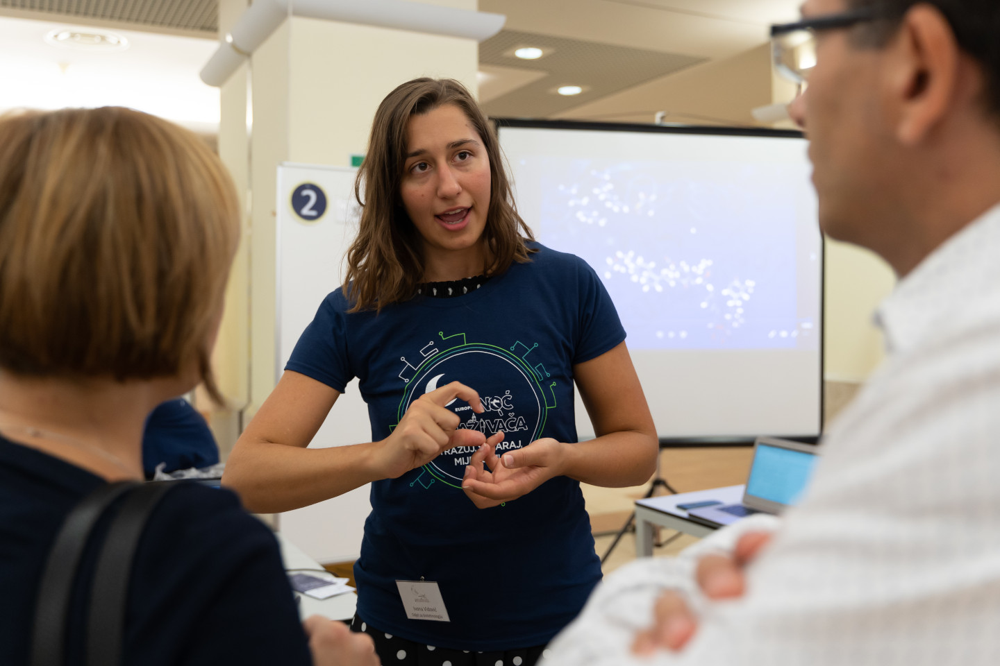
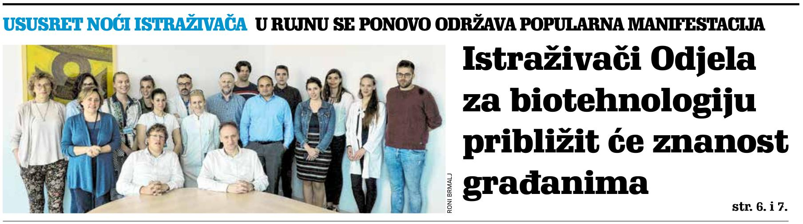
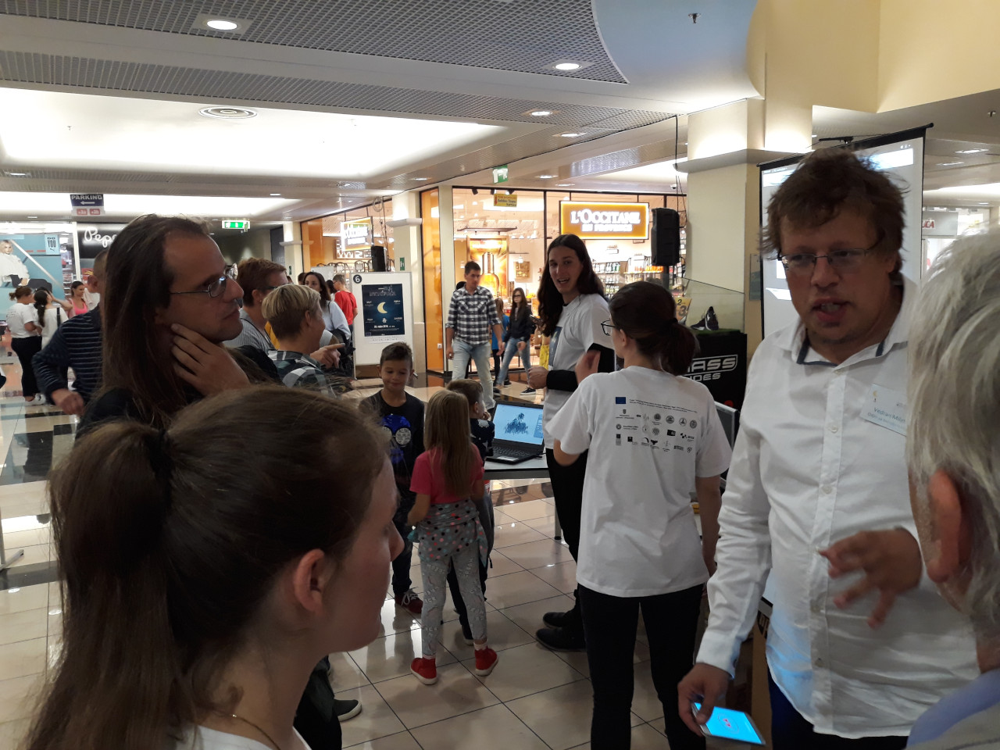
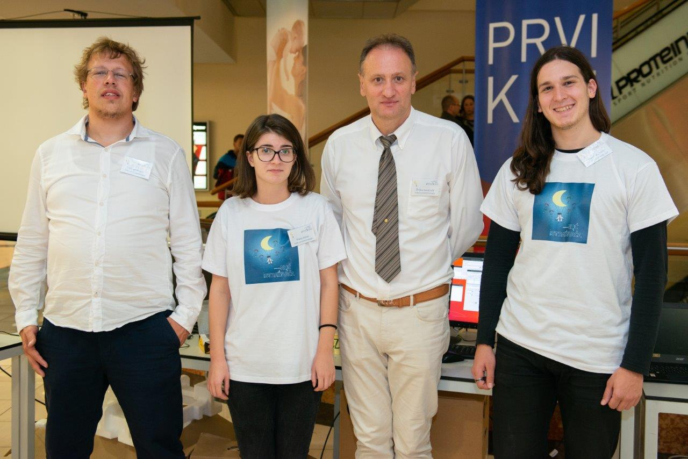
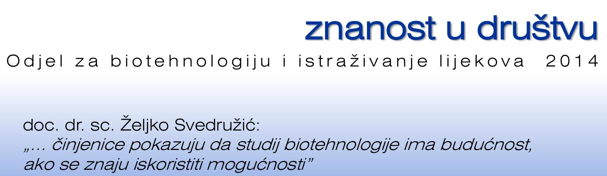
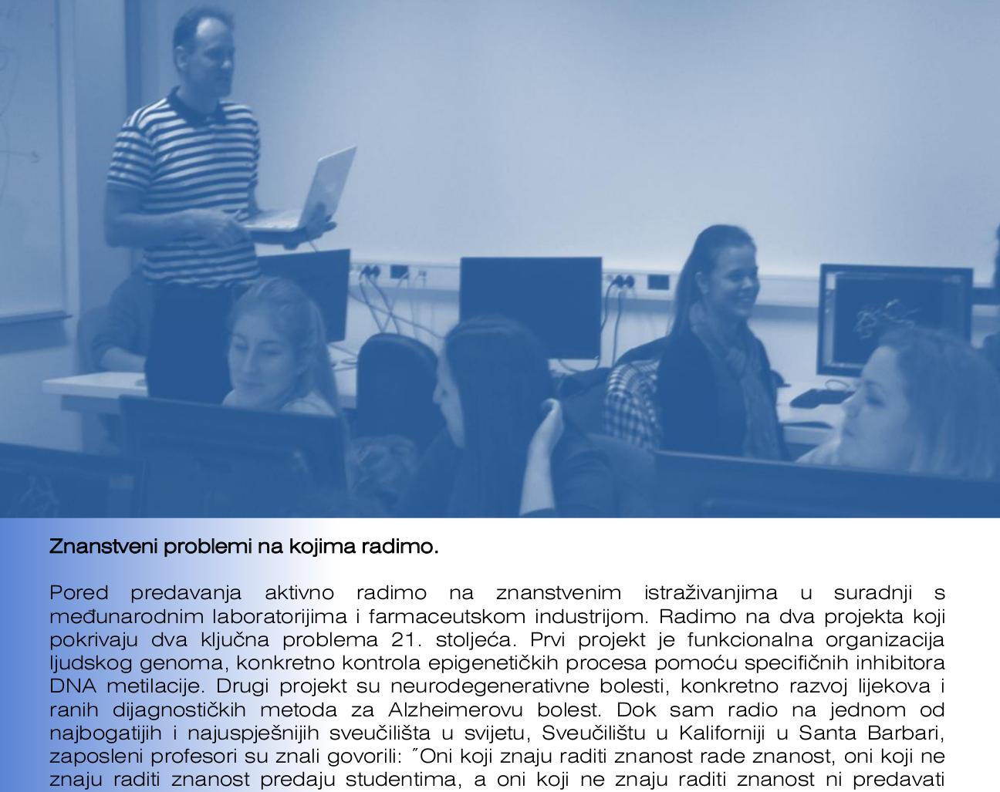
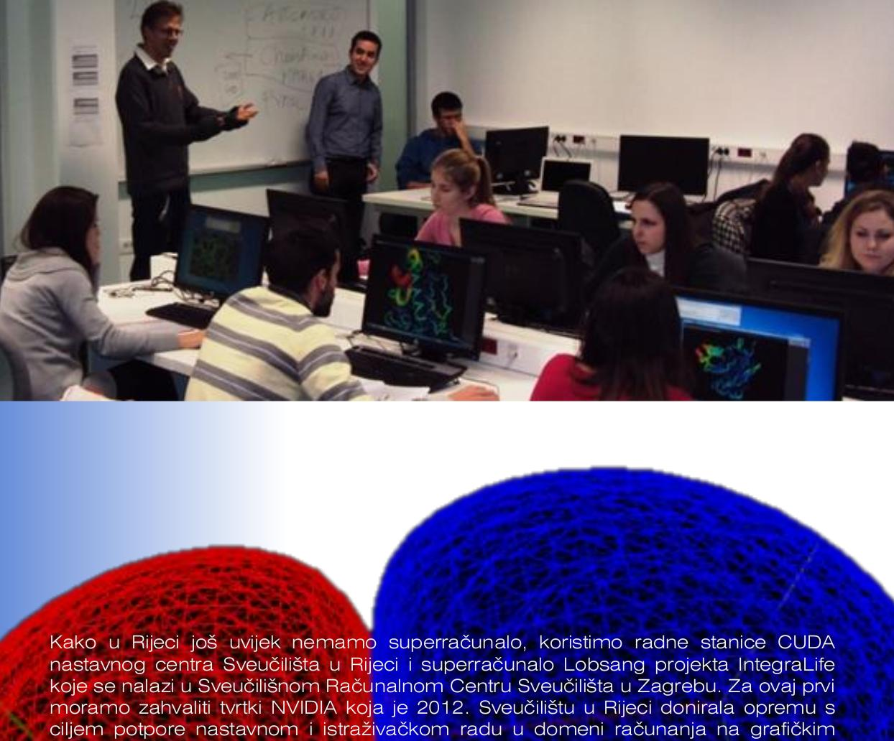

.. _lab-news:

News
====

Polyoxometalates as Effective Nano-inhibitors of Amyloid Aggregation of Pro-inflammatory S100A9 Protein Involved in Neurodegenerative Diseases (3th June 2021)
--------------------------------------------------------------------------------------------------------------------------------------------------------------

Our research paper titled `Polyoxometalates as Effective Nano-inhibitors of Amyloid Aggregation of Pro-inflammatory S100A9 Protein Involved in Neurodegenerative Diseases <https://pubs.acs.org/doi/full/10.1021/acsami.1c04163>`__ has been published in `Volume 13, Issue 23 <https://pubs.acs.org/toc/aamick/13/23>`__ of `ACS <https://www.acs.org/>`__ journal `Applied Materials & Interfaces <https://pubs.acs.org/journal/aamick>`__.

Abstract
^^^^^^^^

Pro-inflammatory and amyloidogenic S100A9 protein is central to the amyloid-neuroinflammatory cascade in neurodegenerative diseases. Polyoxometalates (POMs) constitute a diverse group of nanomaterials, which showed potency in amyloid inhibition. Here, we have demonstrated that two selected nanosized niobium POMs, Nb10 and TiNb9, can act as potent inhibitors of S100A9 amyloid assembly. Kinetics analysis based on ThT fluorescence experiments showed that addition of either Nb10 or TiNb9 reduces the S100A9 amyloid formation rate and amyloid quantity. Atomic force microscopy imaging demonstrated the complete absence of long S100A9 amyloid fibrils at increasing concentrations of either POM and the presence of only round-shaped and slightly elongated aggregates. Molecular dynamics simulation revealed that both Nb10 and TiNb9 bind to native S100A9 homo-dimer by forming ionic interactions with the positively charged Lys residue-rich patches on the protein surface. The acrylamide quenching of intrinsic fluorescence showed that POM binding does not perturb the Trp 88 environment. The far and near UV circular dichroism revealed no large-scale perturbation of S100A9 secondary and tertiary structures upon POM binding. These indicate that POM binding involves only local conformational changes in the binding sites. By using intrinsic and 8-anilino-1-naphthalene sulfonate fluorescence titration experiments, we found that POMs bind to S100A9 with a Kd of ca. 2.5 μM. We suggest that the region, including Lys 50 to Lys 54 and characterized by high amyloid propensity, could be the key sequences involved in S1009 amyloid self-assembly. The inhibition and complete hindering of S100A9 amyloid pathways may be used in the therapeutic applications targeting the amyloid-neuroinflammatory cascade in neurodegenerative diseases.

`Read the full paper in ACS Applied Materials & Interfaces Volume 13, Issue 23. <https://pubs.acs.org/doi/full/10.1021/acsami.1c04163>`__

Natural Compound from Olive Oil Inhibits S100A9 Amyloid Formation and Cytotoxicity: Implications for Preventing Alzheimer’s Disease (12th May 2021)
---------------------------------------------------------------------------------------------------------------------------------------------------

Our research paper titled `Natural Compound from Olive Oil Inhibits S100A9 Amyloid Formation and Cytotoxicity: Implications for Preventing Alzheimer’s Disease <https://pubs.acs.org/doi/full/10.1021/acschemneuro.0c00828>`__ has been published in `Volume 12, Issue 11 <https://pubs.acs.org/toc/acncdm/12/11>`__ of `ACS <https://www.acs.org/>`__ journal `Chemical Neuroscience <https://pubs.acs.org/journal/acncdm>`__.

Abstract
^^^^^^^^

Polyphenolic compounds in the Mediterranean diet have received increasing attention due to their protective properties in amyloid neurodegenerative and many other diseases. Here, we have demonstrated for the first time that polyphenol oleuropein aglycone (OleA), which is the most abundant compound in olive oil, has multiple potencies for the inhibition of amyloid self-assembly of pro-inflammatory protein S100A9 and the mitigation of the damaging effect of its amyloids on neuroblastoma SH-SY5Y cells. OleA directly interacts with both native and fibrillar S100A9 as shown by intrinsic fluorescence and molecular dynamic simulation. OleA prevents S100A9 amyloid oligomerization as shown using amyloid oligomer-specific antibodies and cross-β-sheet formation detected by circular dichroism. It decreases the length of amyloid fibrils measured by atomic force microscopy (AFM) as well as reduces the effective rate of amyloid growth and the overall amyloid load as derived from the kinetic analysis of amyloid formation. OleA disintegrates already preformed fibrils of S100A9, converting them into nonfibrillar and nontoxic aggregates as revealed by amyloid thioflavin-T dye binding, AFM, and cytotoxicity assays. At the cellular level, OleA targets S100A9 amyloids already at the membranes as shown by immunofluorescence and fluorescence resonance energy transfer, significantly reducing the amyloid accumulation in GM1 ganglioside containing membrane rafts. OleA increases overall cell viability when neuroblastoma cells are subjected to the amyloid load and alleviates amyloid-induced intracellular rise of reactive oxidative species and free Ca2+. Since S100A9 is both a pro-inflammatory and amyloidogenic protein, OleA may effectively mitigate the pathological consequences of the S100A9-dependent amyloid-neuroinflammatory cascade as well as provide protection from neurodegeneration, if used within the Mediterranean diet as a potential preventive measure.

`Read the full paper in ACS Chemical Neuroscience Volume 12, Issue 11. <https://pubs.acs.org/doi/full/10.1021/acschemneuro.0c00828>`__

Structural Analysis of the Simultaneous Activation and Inhibition of γ-Secretase Activity in the Development of Drugs for Alzheimer's Disease (8th April 2021)
--------------------------------------------------------------------------------------------------------------------------------------------------------------

Our research paper titled `Structural Analysis of the Simultaneous Activation and Inhibition of γ-Secretase Activity in the Development of Drugs for Alzheimer's Disease <https://www.mdpi.com/1999-4923/13/4/514>`__ has been published in special issue `Covalent Inhibitors as Selective Drug Candidates <https://www.mdpi.com/journal/pharmaceutics/special_issues/Drug_Candidates>`__ of `MDPI <https://www.mdpi.com/>`__ open access journal `Pharmaceutics <https://www.mdpi.com/journal/pharmaceutics>`__.

Abstract
^^^^^^^^

**Significance:** The majority of the drugs which target membrane-embedded protease γ-secretase show an unusual biphasic activation–inhibition dose-response in cells, model animals, and humans. Semagacestat and avagacestat are two biphasic drugs that can facilitate cognitive decline in patients with Alzheimer's disease. Initial mechanistic studies showed that the biphasic drugs, and pathogenic mutations, can produce the same type of changes in γ-secretase activity. **Results:** DAPT, semagacestat LY-411,575, and avagacestat are four drugs that show different binding constants, and a biphasic activation–inhibition dose-response for amyloid-β-40 products in SH-SY5 cells. Multiscale molecular dynamics studies have shown that all four drugs bind to the most mobile parts in the presenilin structure, at different ends of the 29 Å long active site tunnel. The biphasic dose-response assays are a result of the modulation of γ-secretase activity by the concurrent binding of multiple drug molecules at each end of the active site tunnel. The drugs activate γ-secretase by facilitating the opening of the active site tunnel, when the rate-limiting step is the tunnel opening, and the formation of the enzyme–substrate complex. The drugs inhibit γ-secretase as uncompetitive inhibitors by binding next to the substrate, to dynamic enzyme structures which regulate processive catalysis. The drugs can modulate the production of different amyloid-β catalytic intermediates by penetration into the active site tunnel, to different depths, with different flexibility and different binding affinity. **Conclusions:** Biphasic drugs and pathogenic mutations can affect the same dynamic protein structures that control processive catalysis. Successful drug-design strategies must incorporate transient changes in the γ-secretase structure in the development of specific modulators of its catalytic activity.

`Read the full paper in Pharmaceutics volume 13, issue 4. <https://www.mdpi.com/1999-4923/13/4/514>`__

Diverse SARS-CoV-2 variants preceded the initial COVID-19 outbreak in Croatia (24th March 2021)
-----------------------------------------------------------------------------------------------

Our brief report titled `Diverse SARS-CoV-2 variants preceded the initial COVID-19 outbreak in Croatia <https://link.springer.com/article/10.1007/s00705-021-05029-7>`__ has been published in `Archives of Virology <https://www.springer.com/journal/705/>`__.

Abstract
^^^^^^^^

We developed a next-generation SARS-CoV-2 sequencing platform and obtained the first SARS-CoV-2 sequences from patients in Croatia at the beginning of the COVID-19 outbreak in the spring of 2020. Integrating the sequencing and the epidemiological data, we show that patients were infected with different SARS-CoV-2 variants belonging to different clades (mostly G and GH). This result confirms that there was widespread virus transmission early in 2020. Interestingly, we identified a unique mutation resulting in a V13I substitution in Nsp5A, the main viral protease, in a patient who had not received antiviral therapy.

`Read the brief report in Archives of Virology. <https://link.springer.com/article/10.1007/s00705-021-05029-7>`__

Structural Analysis of Simultaneous Activation and Inhibition of Gamma-Secretase Activity in Development of Drugs for Alzheimer's Disease (22nd September 2020)
---------------------------------------------------------------------------------------------------------------------------------------------------------------

Our research preprint titled `Structural Analysis of Simultaneous Activation and Inhibition of Gamma-Secretase Activity in Development of Drugs for Alzheimer's Disease <https://www.biorxiv.org/content/10.1101/2020.09.22.307959v1>`__ has been uploaded to `BioRxiv <https://www.biorxiv.org/>`__.

Abstract
^^^^^^^^

Significance: The majority of drugs that target membrane-embedded protease gamma-secretase show unusual biphasic activation-inhibition dose-response in cells, model animals, and humans. Semagacestat and avagacestat are two biphasic-drugs that can facilitate cognitive decline in patients with Alzheimers disease. Initial mechanistic studies showed that the biphasic-drugs, and pathogenic mutations, can produce the same type of changes in γ-secretase activity.

Results: DAPT, semagacestat LY-411,575, and avagacestat are four drugs that show different binding constants, and biphasic activation-inhibition dose-response curves, for amyloid-beta-40 products in SHSY-5 cells. Multiscale molecular dynamics studies showed that all four drugs bind to the most mobile parts in presenilin structure, at different ends of the 29 A long active site tunnel. Combined results from structure-activity studies, showed that the biphasic dose-response curves are a result of modulation of gamma-secretase activity by concurrent binding of multiple drug molecules at each end of the active site tunnel. The drugs activate gamma-secretase by forcing the active site tunnel to open, when the rate-limiting step is the tunnel opening, and formation of the enzyme-substrate complex. The drugs inhibit gamma-secretase as uncompetitive inhibitors, by binding next to the substrate to dynamic enzyme structures that regulate processive catalysis. The drugs can modulate the production of different amyloid-beta catalytic intermediates, by penetrating into the active site tunnel to different depth with different binding affinity. The drugs and pathogenic mutations affect the same dynamic processes in gamma-secretase structure.

Conclusions: Biphasic-drugs like disease-causing mutations can reduce the catalytic capacity of gamma-secretase and facilitate pathogenic changes in amyloid metabolism.

`Read the full preprint on BioRxiv. <https://www.biorxiv.org/content/10.1101/2020.09.22.307959v1>`__

Substrate Channeling via a Transient Protein-Protein Complex: The case of D-Glyceraldehyde-3-Phosphate Dehydrogenase and L-Lactate Dehydrogenase published in Nature Scientific Reports (26th June 2020)
--------------------------------------------------------------------------------------------------------------------------------------------------------------------------------------------------------

Our research paper titled `Substrate Channeling via a Transient Protein-Protein Complex: The case of D-Glyceraldehyde-3-Phosphate Dehydrogenase and L-Lactate Dehydrogenase <https://www.nature.com/articles/s41598-020-67079-2>`__ authored by :ref:`Željko Svedružić <zms>`, :ref:`Ivica Odorčić <lab-people>`, `Christopher Chang <https://www.nrel.gov/research/christopher-chang.html>`__, and `Draženka Svedružić <https://www.nrel.gov/research/drazenka-svedruzic.html>`__ has been published today in `Nature Scientific Reports <https://www.nature.com/srep/>`__.

Abstract
^^^^^^^^

Substrate channeling studies have frequently failed to provide conclusive results due to poor understanding of this subtle phenomenon. We analyzed the mechanism of NADH-channeling from D-glyceraldehyde-3-phosphate dehydrogenase (GAPDH) to L-lactate Dehydrogenase (LDH) using enzymes from different cells. Enzyme kinetics studies showed that LDH activity with free NADH and GAPDH-NADH complex always take place in parallel. The channeling is observed only in assays that mimic cytosolic conditions where free NADH concentration is negligible and the GAPDH-NADH complex is dominant. Molecular dynamics and protein-protein interaction studies showed that LDH and GAPDH can form a leaky channeling complex only at the limiting NADH concentrations. Surface calculations showed that positive electric field between the NAD(H) binding sites on LDH and GAPDH tetramers can merge in the LDH-GAPDH complex. NAD(H)-channeling within the LDH-GAPDH complex can be an extension of NAD(H)-channeling within each tetramer. In the case of a transient LDH-(GAPDH-NADH) complex, the relative contribution from the channeled and the diffusive paths depends on the overlap between the off-rates for the LDH-(GAPDH-NADH) complex and the GAPDH-NADH complex. Molecular evolution or metabolic engineering protocols can exploit substrate channeling for metabolic flux control by fine-tuning substrate-binding affinity for the key enzymes in the competing reaction paths.

`Read the full paper in Nature Scientific Reports volume 10. <https://www.nature.com/articles/s41598-020-67079-2>`__

BioSFGroup featured in Novi list's VOX academiae (17th April 2020)
------------------------------------------------------------------

BioSFGroup's :ref:`Patrik Nikolić <lab-people>` and :ref:`Dr. Vedran Miletić <lab-people>`'s figure was featured in `Novi list's <https://www.novilist.hr/>`__ University of Rijeka-themed monthly attachment `VOX academiae <https://uniri.hr/sveuciliste-i-drustvo/vox-academiae/>`__ :download:`issue 27 <_downloads/VOX-academiae-27-2020-04-17.pdf>` (page 2 and page 3: *Epicentar znanstvenika u borbi protiv klimatskih promjena i virusa*).

.. figure:: _images/VOX-academiae-27-2020-04-17.jpg

On page 3, speaking about :ref:`the research being carried out in the lab <lab-research>`, the article writes:

    *The design of new drugs is a complex research process that nowadays is largely performed on a supercomputer. Six years ago, an interdisciplinary collaboration was started within the Laboratory for the Structure and Function of Biomolecules between Dr. Željko Svedružić from the Department of Biotechnology and Dr. Vedran Miletić from the Department of Informatics. Active use to simulate the molecular dynamics and chemical reactions described by quantum physics and predict ligand binding. So far, highly specific DNA methylation inhibitors have been designed at Bura to be used in tissue regeneration by genetic reprogramming of cells. Such inhibitors are marketed for several thousand dollars per gram, which is two orders of magnitude more expensive than gold.*

..
  Additionally, they are collaborating with Swedish academic Astrid Gräslund to study protein aggregation in the Alzheimer's disease process, for which simulations are also performed on the Bura, and recently, in collaboration with Dr. Anna Sablina of the Flemish Institute for Biotechnology in Belgium, they have begun high-throughput molecular screenings for molecules that can serve in the process of regulating RAS proteins, whose excessive activity influences cancer formation.

:download:`Read the full text in VOX academiae issue 19 (in Croatian). <_downloads/VOX-academiae-19-2019-08-02.pdf>`

Substrate Channeling via a Transient Protein-Protein Complex: The case of D-Glyceraldehyde-3-Phosphate Dehydrogenase and L-Lactate Dehydrogenase published on bioRxiv (23rd January 2020)
-----------------------------------------------------------------------------------------------------------------------------------------------------------------------------------------

Background: D-Glyceraldehyde-3-phosphate dehydrogenase (GAPDH) and L-lactate dehydrogenase (LDH) can form a complex that can regulate the major metabolic pathways, however, the exact mechanism remains unknown. We analyzed a possibility of NADH-channeling from GAPDH-NADH complex to LDH isozymes using enzymes from different cells.

Results: Enzyme-kinetics and NADH-binding studies showed that LDH can use GAPDH-NADH complex as a substrate. LDH activity with GAPDH-NADH complex was challenged with anti-LDH antibodies to show that the channeled and the diffusive reactions always take place in parallel. The channeling path is dominant only in assays with limiting free-NADH concertation that mimic cytosolic conditions. Analytical ultracentrifugation showed that the channeling does not require a high affinity complex. Molecular dynamics calculations and protein-protein interaction studies showed that LDH and GAPDH can form a leaky channeling complex only at subsaturating NADH concentrations. The interaction sites are conserved between LDH isozymes from heart and muscle, and between GAPDH molecules from rabbit and yeast cells. Positive electric fields between the NAD(H) binding sites on LDH and GAPDH tetramers, showed that NAD(H)-channeling within the LDH-GAPDH complex, can be an extension of NAD(H)-channeling between the adjacent subunits in each tetramer.

Conclusions: In the case of a transient (GAPDH-NADH)-LDH complex, the relative contribution from the channeled and the diffusive paths depends on the overlap between off-rates for the transient (GAPDH-NADH)-LDH complex and off-rates for the GAPDH-NADH complex. Molecular evolution or metabolic engineering protocols can exploit substrate channeling for metabolic flux control by fine-tuning substrate-binding affinity for the key enzymes in the competing reaction paths.

`Read the full paper on bioRxiv. <https://www.biorxiv.org/content/10.1101/2020.01.22.916023v1>`__

European Researchers' Night 2019 (27th September 2019)
------------------------------------------------------

`European Researchers' Night 2019 in Rijeka <https://uniri.hr/vijesti/europska-noc-istrazivaca-u-rijeci-27-rujna-2019/>`__ took place in Tower Center on friday, 27th September 2019. BioSFGroup participated with the topic *Supercomputer Bura: our window to the world of molecules*.

.. figure:: _images/noc-istrazivaca-2019-biosflab-1.jpg

:download:`View the program of the European Researchers' Night 2019 in Rijeka (in Croatian). <_downloads/noc-istrazivaca-2019-rijeka-program.pdf>`

`View MojaRijeka.hr's video report about European Researchers' Night 2018 in Rijeka (in Croatian) <https://youtu.be/GfEbI4Nr8Gg>`__

`Read University of Rijeka's report about European Researchers' Night 2018 (in Croatian) <https://uniri.hr/vijesti/europska-noc-istrazivaca-u-rijeci-27-rujna-2019/>`__

BioSFGroup featured in Novi list's VOX academiae (2nd August 2019)
------------------------------------------------------------------

BioSFGroup's :ref:`Prof. Dr. Željko Svedružić <zms>` and :ref:`Dr. Vedran Miletić <lab-people>` were featured in `Novi list's <https://www.novilist.hr/>`__ University of Rijeka-themed monthly attachment `VOX academiae <https://uniri.hr/sveuciliste-i-drustvo/vox-academiae/>`__ :download:`issue 19 <_downloads/VOX-academiae-19-2019-08-02.pdf>` (page 1; pages 6–7: *Istraživači Odjela za biotehnologiju približavaju znanosti građanima*).

Speaking about :ref:`the research being carried out in the lab <lab-research>`, Dr. Svedružić went straight to the point:

    *The design of new drugs and the development of disease are complex molecular processes that require the power of supercomputers to be visualized and quantitatively analyzed. In the last four years, we have been in the field of supercomputing protocols for quantum mechanics, bioinformatics and molecular dynamics. We used protocols to solve five problems in the biomedical sciences.*

He then listed :ref:`the accomplishments <zms-accomplishments>` and :ref:`the results <zms-publications>` from :ref:`the present research projects <lab-projects>`.

.. figure:: _images/VOX-academiae-19-2019-08-02-page-6.jpg

:download:`Read the full text in VOX academiae issue 19 (in Croatian). <_downloads/VOX-academiae-19-2019-08-02.pdf>`

Pro-Inflammatory S100A9 Protein Aggregation Promoted by NCAM1 Peptide Constructs published in ACS Chemical Biology (5th June 2019)
----------------------------------------------------------------------------------------------------------------------------------

Our research paper titled `Pro-Inflammatory S100A9 Protein Aggregation Promoted by NCAM1 Peptide Constructs <https://pubs.acs.org/doi/full/10.1021/acschembio.9b00394>`__ authored by `Jonathan Pansieri <https://www.umu.se/en/staff/jonathan-pansieri/>`__, :ref:`Lucija Ostojić <lab-people>`, `Igor A. Iashchishyn <https://www.umu.se/en/staff/igor-iashchishyn/>`__, Mazin Magzoub, Cecilia Wallin, Sebastian K. T. S. Wärmländer, Astrid Gräslund, Mai Nguyen Ngoc, Vytautas Smirnovas, :ref:`Željko Svedružić <zms>`, and `Ludmilla A. Morozova-Roche <https://www.umu.se/en/staff/ludmilla-morozova-roche/>`__ (`research group <https://www.umu.se/en/research/groups/ludmilla-morozova-roche/>`__) has been published today in `ACS Chemical Biology <https://pubs.acs.org/journal/acbcct>`__.

Abstract
^^^^^^^^

Amyloid cascade and neuroinflammation are hallmarks of neurodegenerative diseases, and pro-inflammatory S100A9 protein is central to both of them. Here, we have shown that NCAM1 peptide constructs carrying polycationic sequences derived from Aβ peptide (KKLVFF) and PrP protein (KKRPKP) significantly promote the S100A9 amyloid self-assembly in a concentration-dependent manner by making transient interactions with individual S100A9 molecules, perturbing its native structure and acting as catalysts. Since the individual molecule misfolding is a rate-limiting step in S100A9 amyloid aggregation, the effects of the NCAM1 construct on the native S100A9 are so critical for its amyloid self-assembly. S100A9 rapid self-assembly into large aggregated clumps may prevent its amyloid tissue propagation, and by modulating S100A9 aggregation as a part of the amyloid cascade, the whole process may be effectively tuned.

`Read the full paper in ACS Chemical Biology volume 14 issue 7. <https://pubs.acs.org/doi/full/10.1021/acschembio.9b00394>`__

European Researchers' Night 2018 (28th September 2018)
------------------------------------------------------

`European Researchers' <https://youtu.be/_65gSYQ57bs>`__ `Night 2018 <https://youtu.be/52U9xF-fIzI>`__ `in Rijeka <https://youtu.be/3KczFTftjnw>`__ took place in `Tower Center <https://www.tower-center-rijeka.hr/magazin/sto-vas-sve-ceka-na-noci-istrazivaca/>`__ on friday, 28th September 2018. BioSFGroup participated with the topic *Microscope vs. supercomputers in pharmacy (supercomputers are 21st century microscopes)*.

.. figure:: _images/noc-istrazivaca-2018-rajna-vedran-zeljko.jpg

:download:`View the program of the European Researchers' Night 2018 in Rijeka (in Croatian). <_downloads/noc-istrazivaca-2018-rijeka-program.pdf>`

`View Kanal Ri's video report about European Researchers' Night 2018 in Rijeka (in Croatian) <https://youtu.be/3KczFTftjnw>`__

`Read University of Rijeka's report about European Researchers' Night 2018 (in Croatian) <https://uniri.hr/vijesti/sudjelovalo-preko-18-000-gradana/>`__

`View the organizer's video report about European Researchers' Night 2018 in Zagreb, Split, Rijeka, and Pula (in English) <https://youtu.be/_65gSYQ57bs>`__

`View the organizer's video report about European Researchers' Night 2018 in Zagreb, Split, Rijeka, and Pula (in Croatian) <https://youtu.be/52U9xF-fIzI>`__

In silico design of the first DNA-independent mechanism-based inhibitor of mammalian DNA methyltransferase Dnmt1 published in PLOS ONE (11th April 2017)
--------------------------------------------------------------------------------------------------------------------------------------------------------

Our research paper titled `In silico design of the first DNA-independent mechanism-based inhibitor of mammalian DNA methyltransferase Dnmt1 <https://journals.plos.org/plosone/article?id=10.1371/journal.pone.0174410>`__ authored by :ref:`Vedran Miletić <lab-people>`, :ref:`Ivica Odorčić <lab-people>`, :ref:`Patrik Nikolić <lab-people>`, and :ref:`Željko Svedružić <zms>` has been published today in `PLOS ONE <https://journals.plos.org/plosone/>`__, the flagship Open Access journal.

Background
^^^^^^^^^^

We use our earlier experimental studies of the catalytic mechanism of DNA methyltransferases to prepare in silico a family of novel mechanism-based inhibitors of human Dnmt1. Highly specific inhibitors of DNA methylation can be used for analysis of human epigenome and for the creation of iPS cells.

Results
^^^^^^^

We describe a set of adenosyl-1-methyl-pyrimidin-2-one derivatives as novel mechanism-based inhibitors of mammalian DNA methyltransferase Dnmt1. The inhibitors have been designed to bind simultaneously in the active site and the cofactor site and thus act as transition-state analogues. Molecular dynamics studies showed that the lead compound can form between 6 to 9 binding interactions with Dnmt1. QM/MM analysis showed that the upon binding to Dnmt1 the inhibitor can form a covalent adduct with active site Cys1226 and thus act as a mechanism-based suicide-inhibitor. The inhibitor can target DNA-bond and DNA-free form of Dnmt1, however the suicide-inhibition step is more likely to happen when DNA is bound to Dnmt1. The validity of presented analysis is described in detail using 69 modifications in the lead compound structure. In total 18 of the presented 69 modifications can be used to prepare a family of highly specific inhibitors that can differentiate even between closely related enzymes such as Dnmt1 and Dnmt3a DNA methyltransferases.

Conclusions
^^^^^^^^^^^

Presented results can be used for preparation of some highly specific and potent inhibitors of mammalian DNA methylation with specific pharmacological properties.

`Read the full paper in PLOS ONE volume 12 issue 4. <https://journals.plos.org/plosone/article?id=10.1371/journal.pone.0174410>`__

BioSFGroup featured in student journal Biotech – znanost u društvu (10th January 2015)
--------------------------------------------------------------------------------------

BioSFGroup's :ref:`Prof. Dr. Željko Svedružić <zms>`, :ref:`Patrik Nikolić <lab-people>`, and :ref:`Vedran Miletić <lab-people>` were featured in in `University of Rijeka <https://www.uniri.hr/>`__ `Department of Biotechnology <https://www.biotech.uniri.hr/>`__ student journal Biotech – znanost u društvu :download:`issue 3 <_downloads/biotech-znanost-u-drustvu-2014-12.pdf>` (`also available on Issuu <https://issuu.com/biotech_ri/docs/__asopis_2014-novo>`__) from December 2014 (front page; pages 9–16: *interview: doc. dr. sc. Željko Svedružić*; page 17: *interview: Patrik Nikolić*; pages 18–19: *interview: Vedran Miletić*).

Discussing `the study programmes at the Department of Biotechnology <https://www.biotech.uniri.hr/en/study-programmes.html>`__, Dr. Svedružić was optimistic about their future in spite of the present challenges:

    *Two years ago, economic experts in the German government pointed out that the development of biotechnology was the future of German industry. Finally, the pharmaceutical and related biochemical industries are today among the few industries in Croatia that are positively operating and competitive in the international market, despite a lagging administrative and political environment. Therefore, the facts show that studying biotechnology has a future, if the opportunities are exploited.*

:download:`Read the full text in Biotech – znanost u društvu issue 3 (in Croatian). <_downloads/biotech-znanost-u-drustvu-2014-12.pdf>`
